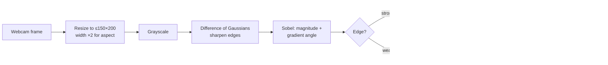

# webcam-to-ascii


**A real-time webcam viewer that renders live video as ASCII art in your terminal** — for terminal-art hobbyists, retro-computing tinkerers, and anyone who wants their face drawn in 95 printable characters.

Most webcam-to-ASCII converters map each pixel's brightness to a short ramp (` .:-=+*#%@`). This project does more: it runs Sobel edge detection on a Difference-of-Gaussians-enhanced frame, then picks each glyph from the gradient *direction* (`/ - \ |`) for edges and from a 95-character luminance ramp for shading. The result reads like a hand-drawn line sketch instead of a blocky heat map.

## ✨ Features

- **Live, real-time rendering** — every captured frame is converted and printed to the terminal in a tight loop; quit with `q`.
- **Directional edge glyphs** — strong edges are drawn with `/ - \ |` chosen from the Sobel gradient angle, so strokes follow the actual contours of the scene.
- **95-character luminance ramp** — shading is mapped through the full printable ASCII set, giving far more dynamic range than a typical 10-step ramp.
- **Ink-weighted character ramp** — glyphs are ranked by their real rendered "ink" (dark-pixel count in a font), not by a hand-tuned guess, so brightness maps perceptually.
- **Difference-of-Gaussians preprocessing** — sharpens edges before detection, keeping thin features (hair, glasses, text) visible at low resolution.
- **Aspect-ratio-corrected sizing** — output is clamped to 150 columns × 200 rows with width doubled to compensate for the ~2:1 height/width ratio of a terminal cell.
- **Live preview window** — the raw webcam frame is shown alongside the terminal output via an OpenCV window.
- **Helper utilities included** — scripts to enumerate cameras, regenerate the ink-usage ramp, and render a still image offline for tuning.

## 📦 Installation

**Prerequisites:** Python 3.9+, a working webcam, and (on macOS) Terminal granted camera access in *System Settings → Privacy & Security → Camera*.

Clone the repository:

```bash
git clone <your-repo-url>/webcam-to-ascii.git
cd webcam-to-ascii
```

Create and activate a virtual environment (recommended):

```bash
python -m venv .venv
source .venv/bin/activate        # macOS / Linux
# .venv\Scripts\activate         # Windows
```

Install the dependencies:

```bash
pip install -r requirements.txt
```

> **Note on `skimage`:** `requirements.txt` lists `skimage>=0.0`, the legacy alias package for **scikit-image**. If pip cannot resolve it, install the real package directly: `pip install scikit-image`.

The full dependency set is OpenCV (`opencv-python`, `opencv-contrib-python`, `opencv-python-headless`), NumPy, Pillow, scikit-image, and Matplotlib.

## 🚀 Usage

Run the main viewer (note the space in the filename — quotes are required):

```bash
python "webcam ascii.py"
```

The terminal fills with the live ASCII render; a separate *Webcam Feed* window shows the source frame. **Press `q`** (with the preview window focused) to stop and release the camera.

Using a different camera? Find its index first, then point the viewer at it:

```bash
python "list webcams.py"
```

```python
# In "webcam ascii.py", change the device index on this line:
cap = cv2.VideoCapture(0)   # ← 0 is the default webcam
```

### What you'll see

Each frame is printed as a block of glyphs up to ~150 characters wide. Edges appear as directed strokes (`/ \ | -`); flat regions fill with progressively denser characters from space (dark) toward `@` (bright). The terminal scrolls continuously — for the cleanest look, run it in a tall, narrow terminal with a small monospace font.

## ⚙️ Configuration

There is no CLI flag parser; behavior is tuned by editing constants at the top of each script.

| Constant | Default | Where | Description |
|---|---|---|---|
| `MAX_WIDTH_CHARS` | `150` | all render scripts | Maximum output columns. Width is doubled internally to correct terminal-cell aspect ratio. |
| `MAX_HEIGHT_LINES` | `200` (`63` in still-image script) | all render scripts | Maximum output rows. |
| `cv2.VideoCapture(0)` | `0` | `webcam ascii.py`, `web ascii cv2.py` | Camera device index. |
| `apply_dog(image, sigma1=1, sigma2=2)` | `1`, `2` | render scripts | Difference-of-Gaussians sigmas; widening the gap sharpens more aggressively. |
| `ord('q')` | `q` | `webcam ascii.py`, `web ascii cv2.py` | Key that stops the loop and releases the camera. |

## 🧱 How it works

The renderer is a four-stage pipeline. Per frame:



**1. Capture & resize.** Each frame is clamped to fit 150 columns or 200 rows, then its width is doubled because terminal cells are roughly twice as tall as they are wide.

**2. Edge enhancement.** A Difference-of-Gaussians (DoG) pass subtracts a heavily blurred copy from a lightly blurred one, suppressing flat regions and amplifying edges.

**3. Sobel detection with direction.** Sobel operators in X and Y yield a gradient *magnitude* (how strong the edge is) and *angle* (which way it points).

**4. Glyph selection.** For every cell: if the gradient magnitude ranks in the denser end of the ramp, the cell is an edge and gets a direction glyph (`/ - \ |`) chosen from the rounded angle. Otherwise it is a shading cell, mapped to the nearest of 95 characters by luminance. Edge glyphs override shading so line work stays crisp.

The 95-character ramp is itself the interesting detail: each printable ASCII character was rendered in a font and its dark-pixel count ("ink") measured, then normalized to 0–255. Brighter pixels map to denser glyphs (`@`, `M`, `W`) and darker pixels to lighter ones (`` ` ``, `.`, space). Regenerate it with `sort characters on whitespace.py`.

## 📁 Repository scripts

| File | Purpose |
|---|---|
| `webcam ascii.py` | **Main live viewer.** Webcam → terminal ASCII + preview window. Uses Pillow + scikit-image for DoG. |
| `web ascii cv2.py` | Live viewer variant using OpenCV-only operations (`cv2.GaussianBlur`, `cv2.resize`) for the DoG and resize stages. |
| `just print the final ascii art.py` | Offline renderer for a still image (hardcoded `WIN_20240711_04_17_55_Pro.jpg`) — used to tune the pipeline without a camera. |
| `list webcams.py` | Enumerates available camera indices (Windows `CAP_DSHOW` / DirectShow). |
| `sort characters on whitespace.py` | Builds the ink-usage character ramp by rendering each ASCII glyph in `arial.ttf` and counting dark pixels. |

## 🤝 Contributing

Contributions are welcome. Fork the repo, create a feature branch, and open a pull request describing the change. If you add a tunable, expose it in the **Configuration** table above.

## 📄 License

Licensed under the **GNU Affero General Public License v3.0** ([`AGPL-3.0-or-later`](https://www.gnu.org/licenses/agpl-3.0.html)) — see [`LICENSE`](./LICENSE) for the full text. The AGPL requires that any network-accessible service built on this code also publish its source.
